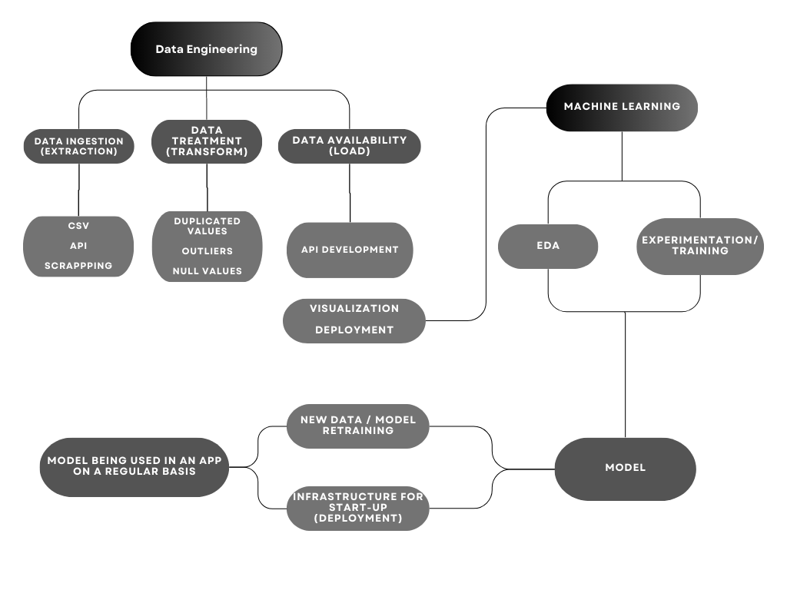

<h1 align=center> <strong>Henry Project Nº1 Data Science</strong> </h1>
<h1 align=center><strong>Machine Learning Operations (MLOps)</strong></h1>

# Introduction and context

Welcome to the first individual project of the labs stage of the Henry Bootcamp! In this occasion, I am going to perform as an MLOps Engineer.  

I was tasked with developing an API using the **FastAPI** framework to make the company's movie datasets available. I was asked to create a minimum viable product ***(MVP)*** that included 6 functions for the API endpoints and another function for a recommendation system using machine learning.

<figcaption>
MLOps process.
</figcaption>  

# Dataset Description and Dictionary

To download the original datasets ("movies_dataset.csv" & "credits.csv"), due to their weight, they can be found at the following link.
[Original Datasets](https://drive.google.com/drive/folders/1O2LYofRceTX13vPotdjWudPCcaJ_7vQM?usp=sharing)

| Field | Description |
|---|---|
| **adult** | Indicates if the movie has an X rating, exclusively for adults. |
| **belongs_to_collection** | A dictionary indicating which movie franchise or series the movie belongs to |
| **budget** | The budget of the film, in dollars |
| **genres** | A dictionary listing all the genres associated with the movie |
| **homepage** | The official website of the film |
| **id** | ID of the movie |
| **imdb_id** | IMDB ID of the movie |
| **original_language** | Original language in which the movie was recorded |
| **original_title** | Original title of the movie |
| **overview** | Small summary of the film |
| **popularity** | Movie popularity score, assigned by TMDB (TheMoviesDataBase) |
| **poster_path** | Movie poster URL |
| **production_companies** | List of production companies associated with the movie |
| **production_countries** | List of countries where the movie was produced |
| **release_date** | Movie release date |
| **revenue** | Collection of the film, in dollars |
| **runtime** | Duration of the movie, in minutes |
| **spoken_languages** | List of languages ​​spoken in the movie |
| **status** | Status of the current movie (if it was announced, if it has already been released, etc.) |
| **tagline** | Famous phrase associated with the movie |
| **title** | Movie title |
| **video** | Indicates whether or not there is a video trailer available in TMDB |
| **vote_average** | Average review score for the movie |
| **vote_count** | Number of votes received for the movie, in TMDB |
| **directors** | The name of the director(s) of each movie |
| **actors** | The name of the actor(s) of each movie |

# Processes

## ETL:
* ***To find out more about the development of the ETL process, there is the following link***  

[ETL Process](https://github.com/FGC97/project1_Henry/blob/main/project1_ETL.ipynb)

***Unnest***: 
1. Some fields, like **`belongs_to_collection production_companies`**, and others are nested, that is they either have a dictionary or a list as values ​​in each row, we un-nest them to be able to do some of the API queries.

***Control of null values***:  

2. The null values ​​of the **`revenue and budget`**, fields are filled with the number 0.
3. We eliminate the null values ​​of the **`release date`**, field.  
  
***Correction in the format of dates***:  

4. We pass the date columns to the YYYY-mm-dd format, and we also create the **`release_year`**, column where we extract the year of the **`release date`**,.

***Create the return column***  

5. We create the column with the return on investment, called **`return with the fields`** **`revenue and budget`**, dividing these last two revenue / budget, when there is no data available to calculate it, it must take the value 0.  

***Drop unused columns***  

6. We remove the columns that will not be used, **`video, imdb_id, adult, original_title, poster_path and homepage`**.

## Functions 
* ***For more information about the development of the different functions and a more detailed explanation of each one, please click the following link.***  

[Functions Notebook](https://github.com/FGC97/project1_Henry/blob/main/project1_Functions.ipynb)

1. **`peliculas_idioma(language: str)`**: This function takes a language as input and returns the number of movies produced in that language.  

2. **`peliculas_duracion(movie: str)`**: This function takes a movie name as input and returns the duration and release year of the movie.  

3. **`franquicia(franquicia: str)`**: This function takes a franchise name as input and returns information about the franchise, such as the number of movies, total revenue, and average revenue.  

4. **`peliculas_pais(pais: str)`**: This function takes a country name as input and returns the number of movies produced in that country.  

5. **`productoras_exitosas(productora: str)`**: This function takes a production company name as input and returns information about the success of the production company, such as total revenue and the number of movies.  

6. **`get_director(director_name: str)`**: This function takes a director name as input and returns information about the director's success, total number of movies, and details of each movie.

## Exploratory Data Analysis & Machine Learning
* ***To inquire more about the development of the EDA process, there is the following link***  

[EDA & Machine Learning](https://github.com/FGC97/project1_Henry/blob/main/project1_EDA_MLOps.ipynb)

7. **`def recomendacion(title:str)`**: The recomendacion function takes a movie title as input and returns a dictionary containing recommendations for similar movies.

* The function first verifies if the input title is a string and normalizes it. 
* It then checks if the title exists in the movie dataset and retrieves the matching movies. For each matching movie, the function filters movies with the same genres and calculates the TF-IDF similarity between the input movie and the filtered movies based on their title and overview. 
* It selects the top 5 most similar movies and creates a dictionary of recommendations, including their genres and vote average. 
* Finally, the function returns a dictionary containing recommendations for each matching movie based on the input title.

## API Deployment

The deployment of our FastAPI is done using **`Render`** a virtual environment. (https://render.com/)

Click to access my FastAPI application:

[API Deployment](https://project1-henry.onrender.com/docs#/)

<figcaption>
MVP FastAPI Recomendation Sytem.
</figcaption>  
